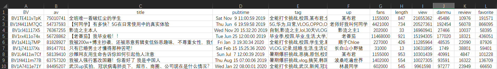
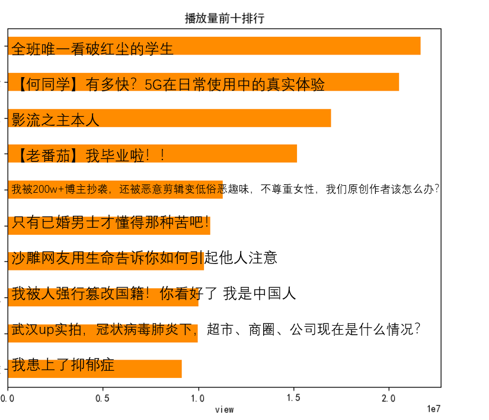
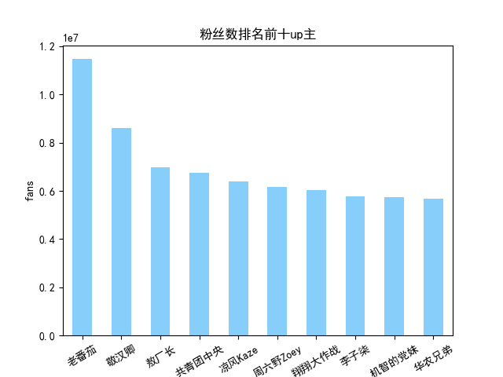

# Get-Bilibili-video-data

## Introduction

Using python to get video data from bilibili (take video-log partition as an example)

## How to get the data

run `get_vlog.py, get_avid, get_left_av.py, get_fans_num, add_fans_to_excel.py` and get a csv file like this.

run other py files to process the data.

## Result

Please check `report.pptx`

